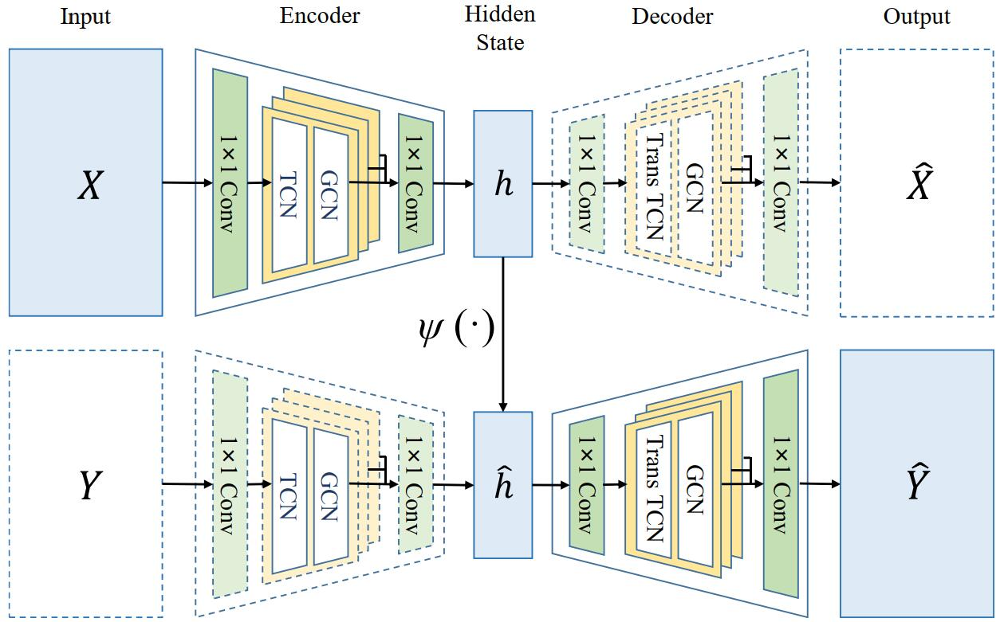

# Spatio-Temporal AutoEncoder for Traffic Flow Prediction

This repository contains the code for the experiments in our paper "Spatio-Temporal AutoEncoder for Traffic Flow Prediction". In this paper, we propose an autoencoder-based traffic flow prediction method, named Spatio-Temporal AutoEncoder (ST-AE). 

## Framework

The core of our method is an autoencoder specially designed to learn the intrinsic patterns from traffic flow data, and encode the current traffic flow information into a low-dimensional representation. The prediction is made by simply projecting the current hidden states to the future hidden states, and then reconstructing the future traffic flows with the trained autoencoder.



## Dataset

The experiments are conducted on four traffic flow datasets from STSGCN[1]: PEMS03, PEMS04, PEMS07 and PEMS08. The h5 file of these datasets can be downloaded from this [link](https://mega.nz/folder/g6YDUKTZ#ZOWHEbiw-B_k3F2wYvHWEA).

[1] C. Song, Y. Lin, S. Guo, and H. Wan, “Spatial-temporal synchronous graph convolutional networks: A new framework for spatial-temporal network data forecasting,” in Proceedings of the AAAI Conference on Artificial Intelligence, vol. 34, no. 01, 2020, pp. 914–921


## Experiment

ST-AE can be trained directly on the datasets, or you can use our provided model in `./pretrained` to finetune.

### Generate train/val/test set

We recommend storing the downloaded h5 files of dataset in the `./data` directory. Then you can run the script `generate_training_data.py` to generate the train/val/test set as follows.

```
python generate_training_data.py --traffic_df_filename 'data/PEMS0X' --history_length 12 --horizon 12
```

### Pretrain 

To obtain a pretrained ST-AE model, you can run the script `ae_train.py` such as:
```
python ae_train.py --epochs 100
```

### Prediction

You can use the pretrained model to predict with finetuning:
```
python train_final.py --load_model True --model_path 'pretrained/PEMS0X_stae.pth'
```

or directly train ST-AE and predict:
```
python train_final.py --load_model False
```
